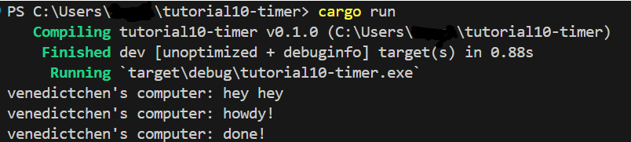

# Experiment README
## 1.2 Understanding how it works
  
- Berdasarkan output yang ada dapat dilihat bahwa hasil print `hey hey` akan muncul terlebih dahulu. Hal ini disebabkan karena `hey hey` berada di luar fungsi async. Fungsi akan melanjutkan program saat masih menunggu hasil dari future oleh proses async. Oleh karena itu `hey hey` akan muncul terlebih dahulu.

