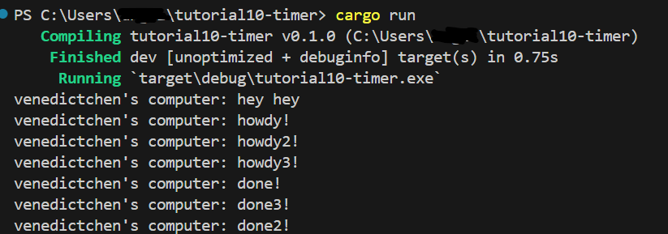
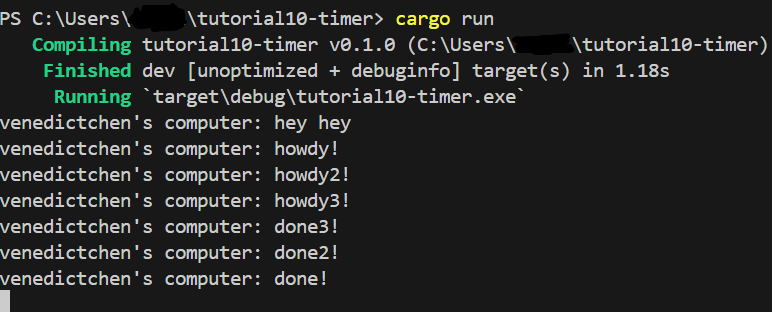

# Experiment README
## 1.2 Understanding how it works
  
- Berdasarkan output yang ada dapat dilihat bahwa hasil print `hey hey` akan muncul terlebih dahulu. Hal ini disebabkan karena `hey hey` berada di luar fungsi async. Fungsi akan melanjutkan program saat masih menunggu hasil dari future oleh proses async. Oleh karena itu `hey hey` akan muncul terlebih dahulu.

## 1.3: Multiple Spawn and removing drop
### Drop on

### Drop off

- Dapat kita lihat bahwa saat kita mematikan `drop(spawner)` program tidak akan berhenti. Saat suatu spawner memanggil fungsi spawn, maka akan tercipta suatu task baru yang disalurkan ke task sender. Executor akan mengambil satu task dari task sender dan melakukan eksekusi dan mengambil lagi hingga task habis dan spawner di drop yang menandakan interaksi berakhir. `drop(spawner)` adalah indikasi bahwa interaksi sudah selesai dan spawner akan dihapus. 